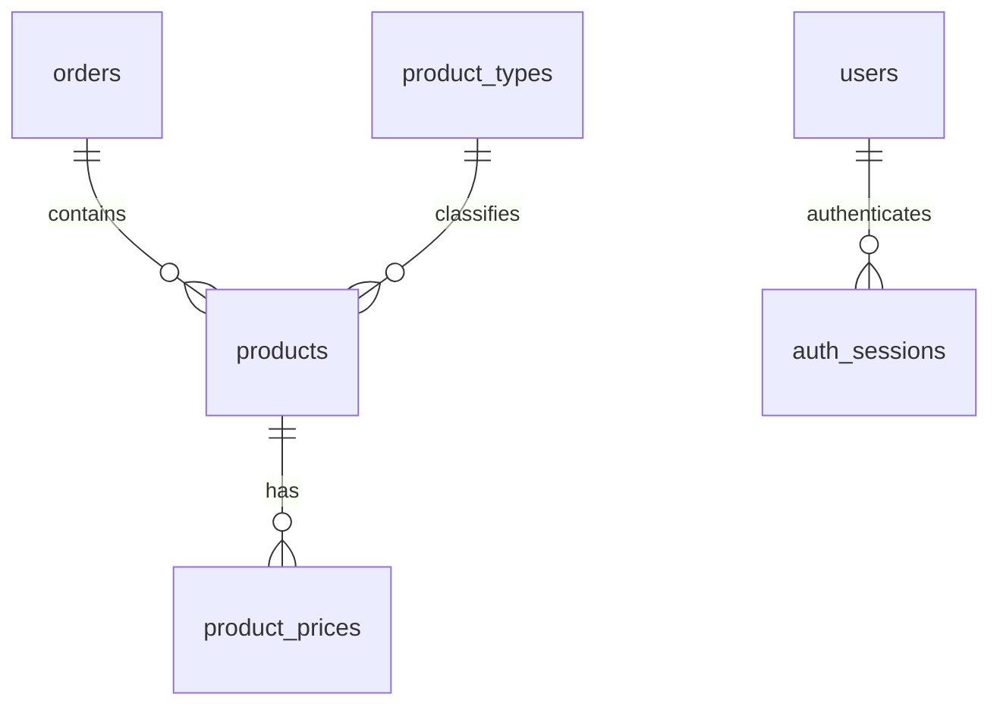

# Схема базы данных

`schema.sql` — исходная структура для MySQL 8.0.16+ (в том числе 8.4). Начальные записи находятся в `seed.sql`; [запуск через Compose](local-development.md) создаёт схему и загружает их в пустую БД. API читает эту БД, React получает данные через API. Удаление выполняется через API с сохранением в MySQL.

| Таблица | Назначение |
| --- | --- |
| `orders` | Название, описание и дата создания прихода. Приход может быть пустым. |
| `product_types` | Справочник типов: мониторы, накопители, клавиатуры. |
| `products` | Товары с обязательными ссылками на приход и тип, серийным номером, состоянием и гарантией. |
| `product_prices` | Цена товара отдельно в каждой валюте и признак основной цены. |
| `users` | Пользователь, уникальный email и хеш пароля. Открытые пароли не хранятся. |
| `auth_sessions` | Сессии пользователя: UUID, ссылка на пользователя и срок действия в UTC. |

## Правила хранения

- Один товар относится к одному приходу и одному типу. Удаление прихода удаляет связанные товары и их цены (`ON DELETE CASCADE`), как в текущем Redux. Используемый тип удалить нельзя (`RESTRICT`).
- `amount_minor` — неотрицательное целое число центов/копеек, без дробной арифметики. `INT UNSIGNED` ограничивает одну цену значением 4 294 967 295 в минимальных единицах. Суммы считаются отдельно для USD и UAH, без конвертации.
- Первичный ключ `(product_id, currency)` запрещает повтор валюты у товара. `CHECK` ограничивает валюты USD и UAH.
- Уникальный индекс с вычисляемым `default_slot` допускает не более одной основной цены. Наличие обеих цен и ровно одной основной должен проверять будущий API; запись товара и цен выполняется в одной транзакции. Сама схема допускает товар без цен.
- Даты создания хранятся в `DATETIME` в UTC; API преобразует их в ISO 8601 с `Z`. Гарантия хранится как календарные даты `DATE`, без часового пояса. Окончание не может быть раньше начала.
- Фото необязательно (`NULL`). Серийный номер — строка; уникальность не навязывается, поскольку в ТЗ такого требования нет.
- Итоговые суммы и количество товаров не хранятся в приходе: вычисляются из связанных записей. При объединении товаров с ценами нельзя считать товары обычным `COUNT(*)` — две валюты удвоят количество; используйте отдельную агрегацию или `COUNT(DISTINCT products.id)`.
- Индексы по `order_id` и `type_id` нужны для связанных товаров и фильтра; индекс по дате прихода — для сортировки. Валидация непустых строк и длины полей также будет в API.

## Соответствие React и SQL

| React | SQL |
| --- | --- |
| `Order.date` | `orders.created_at` |
| `Product.orderId` | `products.order_id` |
| `Product.type` | `product_types.name` через `products.type_id` |
| `serialNumber`, `isNew` | `serial_number`, `is_new` |
| `guarantee.start`, `guarantee.end` | `guarantee_start`, `guarantee_end` |
| `Product.date` | `products.created_at` |
| `price[]` | Строки `product_prices` по `product_id` |
| `amountMinor`, `isDefault` | `amount_minor`, `is_default` |

Остальные поля сохраняют названия. API должен возвращать существующий формат React; техническое поле `default_slot` в ответ не включается.

## MySQL Workbench

Готовая модель: [orders-products.mwb](orders-products.mwb). Откройте её в **MySQL Workbench 8.0** через **File → Open Model**, затем откройте диаграмму **Orders, products and authentication**. Модель содержит шесть таблиц и четыре связи; подключение к серверу для просмотра не требуется.

Модель создана и повторно открыта в Workbench 8.0.47. Проверены 29 колонок, первичные и уникальные ключи, четыре внешних ключа и виртуальное поле `default_slot`. Результат проверки структуры сохранён в [model-validation.json](model-validation.json).

Workbench 8 не представляет табличные `CHECK` отдельными объектами модели. Их условия сохранены в комментариях таблиц `products` и `product_prices`. Для создания БД используйте **schema.sql**, как это делает Docker Compose: он содержит полный набор ограничений. Вычисляемая колонка `default_slot` сохранена в модели как `VIRTUAL` с исходным выражением.

| Дочерняя таблица / поле | Родительская таблица / поле | При удалении родителя |
| --- | --- | --- |
| `products.order_id` | `orders.id` | CASCADE |
| `products.type_id` | `product_types.id` | RESTRICT |
| `product_prices.product_id` | `products.id` | CASCADE |
| `auth_sessions.user_id` | `users.id` | CASCADE |

30.09.2026 структура работающей Docker-БД сверена через `information_schema`: присутствуют шесть таблиц, 29 колонок, четыре внешних ключа с указанными правилами удаления и виртуальная колонка `default_slot`. Проверка была только на чтение, записи не изменялись. Файл модели дополнительно проверен повторным открытием в Workbench 8.0.47.

Официальная инструкция по импорту SQL: https://dev.mysql.com/doc/workbench/en/wb-reverse-engineer-create-script.html

Для создания реальной БД откройте скрипт в SQL Editor подключённого MySQL и выполните его. Он создаёт БД `orders_products` и таблицы без удаления существующих данных. Это первоначальный скрипт, не повторяемая миграция: повторный запуск остановится на уже существующих таблицах. Не запускайте его в рабочей БД с данными; для дальнейших изменений будут отдельные миграции.

## Проверка схемы

Схема выполнена на MySQL 8.4.11 в отдельном временном контейнере. На тестовых записях проверены: неверные ссылки на приход, тип и товар; повтор валюты; вторая основная цена; неподдерживаемая валюта; неверный срок гарантии; отрицательная цена; запрет удаления используемого типа. Все ограничения сработали. Проверены также суммы отдельно по валютам и пустой приход. Каскадное удаление удалило товары и цены только нужного прихода, сохранило другой приход и справочник типов; `ROLLBACK` восстановил данные. Контейнер после проверки остановлен и удалён. Позднее добавлен полный набор демонстрационных данных в `seed.sql` и проверен запуск постоянной локальной БД через Compose (см. [инструкцию](local-development.md)). Добавлен интеграционный тест авторизации (`npm run test:auth`); отдельные автоматические тесты ограничений схемы пока не добавлены.

Авторизация добавляет таблицы users и auth_sessions (пользователь → несколько сессий, ON DELETE CASCADE). [Настройка, миграция существующей базы и проверка](../docs/authentication.md).
